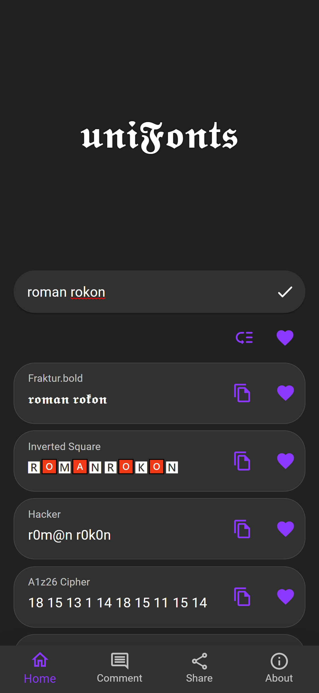

# 𝖚𝖓𝖎𝕱𝖔𝖓𝖙𝖘

𝑨 𝑱𝒂𝒗𝒂𝑺𝒄𝒓𝒊𝒑𝒕 𝒑𝒂𝒄𝒌𝒂𝒈𝒆 𝒕𝒉𝒂𝒕 𝒕𝒖𝒓𝒏 𝒂𝒍𝒑𝒉𝒂𝒏𝒖𝒎𝒆𝒓𝒊𝒄 𝒄𝒉𝒂𝒓𝒂𝒄𝒕𝒆𝒓𝒔 𝒊𝒏𝒕𝒐 𝒖𝒏𝒊𝒗𝒆𝒓𝒔𝒂𝒍 𝒘𝒆𝒊𝒓𝒅 𝒇𝒐𝒏𝒕 𝒔𝒕𝒚𝒍𝒆.

## This is the core library for [uniFonts](https://unifonts-pwa.vercel.app).

<div align="center">

</div>

## 𝑰𝒏𝒔𝒕𝒂𝒍𝒍𝒂𝒕𝒊𝒐𝒏

```
npm install lib-unifonts --save // yarn add lib-unifonts
```

## 𝑼𝒔𝒂𝒈𝒆

```js
import { getAll as unifonts, fraktur } from 'lib-unifonts';

fraktur('The quick brown fox jumps over the lazy dog.', { fontStyle: 'bold' }); // 𝕿𝖍𝖊 𝖖𝖚𝖎𝖈𝖐 𝖇𝖗𝖔𝖜𝖓 𝖋𝖔𝖝 𝖏𝖚𝖒𝖕𝖘 𝖔𝖛𝖊𝖗 𝖙𝖍𝖊 𝖑𝖆𝖟𝖞 𝖉𝖔𝖌

// returns all fonts like this
unifonts(string): [{name: string, value: string}, ...]
```

## 𝑫𝒊𝒇𝒇𝒆𝒓𝒆𝒏𝒄𝒆 𝒃𝒆𝒕𝒘𝒆𝒆𝒏 𝒕𝒉𝒊𝒔 𝒂𝒏𝒅 𝒘𝒆𝒊𝒓𝒅-𝒇𝒐𝒏𝒕𝒔 (𝒂𝒏𝒄𝒆𝒔𝒕𝒐𝒓!)

- A lot more fonts.
- Creating/Adding new fonts is a breeze. (see [./script/instructions](./script/instructions.md))
- Auto generates unit test for each font added.
- Ability to get all fonts with their respective name.

## 𝑪𝒐𝒏𝒕𝒓𝒊𝒃𝒖𝒕𝒊𝒏𝒈

I'm open to any kind of contribution.

- Make sure you have prettier set up

## 𝑳𝒊𝒄𝒆𝒏𝒔𝒆

[MIT](./LICENSE)
